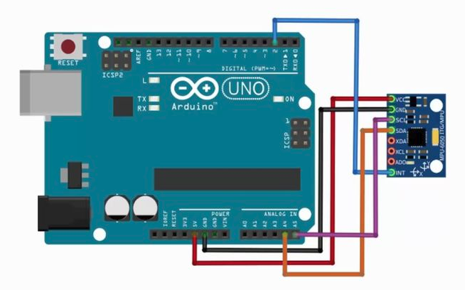
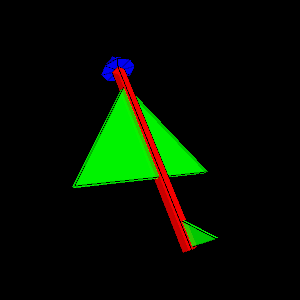

# IMU with Embedded

* [A Guide To using IMU (Accelerometer and Gyroscope Devices) in Embedded Applications](http://www.starlino.com/imu_guide.html)

-----

## Arduino UNO & MPU6050 GY521

* [Arduino教程：MPU6050的数据获取、分析与处理](http://www.geek-workshop.com/thread-15392-1-1.html)
* [How to Interface Arduino and the MPU 6050 Sensor](https://maker.pro/arduino/tutorial/how-to-interface-arduino-and-the-mpu-6050-sensor)
* [Arduino and MPU6050 Accelerometer and Gyroscope Tutorial](https://howtomechatronics.com/tutorials/arduino/arduino-and-mpu6050-accelerometer-and-gyroscope-tutorial/)

### Hardware components

  

### Arduino Apps

1. Download [jrowberg/i2cdevlib/Arduino](https://github.com/jrowberg/i2cdevlib/tree/master/Arduino), copy **I2Cdev** and **MPU6050** to Arduino libraries
2. Open Arduino IDE, **File->Examples->MPU6050->MPU6050_MPU6**
3. `#define OUTPUT_READABLE_YAWPITCHROLL` -> `//#define OUTPUT_READABLE_YAWPITCHROLL`
   `//#define OUTPUT_TEAPOT` -> `#define OUTPUT_TEAPOT`
4. compile and upload

### Processing Apps for 3D Simulation

1. install [Processing IDE](https://processing.org)
2. install [ToxicLib](https://bitbucket.org/postspectacular/toxiclibs/downloads/) into the Processing's libraries folder (modes -> java -> libraries), unzip **toxiclibs-complete-0020.zip** in ToxicLibs and place aLL the contents there
3. running the teapot demo from the **MPU6050_DMP6** example from **Jeff Rowberg's MPU6050 libary**

  

